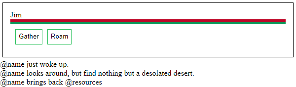
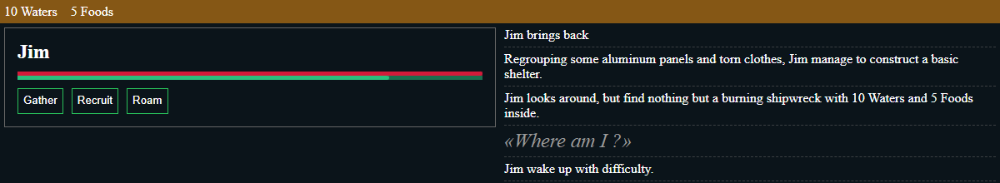

# Logs

I'll use this for to dump all my ideas and thinking process all along the development. This is not going to be pretty, but I hope it will help with saving history and explain my choices.

## 29/08/2023 The start

The other day, I couldn't sleep because I was too eager to start this project. I'm currently on the bus to Kuala Lumpur after a 10 months trip around the world. Honestly, I really miss development.
About 7 years ago (2016) I started to create my first ambitious game idea; [Settlement](https://github.com/GMartigny/settlement). Sadly, I abandoned it. It has become too difficult to maintain because of my lack of experience and outdated build technologies (Grunt).
In 2020, with some experience with Vue.js, I [revive the project](https://github.com/GMartigny/settlement2). However, I quickly give up again. Vue is not really made to create games. Fighting to bend it to my needs was tiring. Also, I guess the will was not really there.
So, third time the charm I hope. The goal will be to ship a working prototype as soon as possible to avoid scope creep like the first time. Secondly, I choose to create my own "game engine". I don't need anything complicated, and it will be more flexible this way. I also hope to learn a bit about JS framework creation.
Before coming back home, I will try to lay down all I need to do for a fun and engaging version 1 and gather some building material.

## 06/09/2023 Where to begin ? (v0.0)

After being settled in 😏, I can finally start the dev. Problem is, I have no idea where to go from here. My first task would be to create a simple, yet powerful enough view framework. I love Vue/Svelte one file component, but that would mean writing a template parser and I don't think that's a good idea. I'm more leaning onto a template string style component like React JSX. Then, the issue is how to make reference to a node inside the component.
Finally, the best solution was inspired by Vue [`h`](https://vuejs.org/guide/extras/render-function.html) function with some memoization to reduce unnecessary renders. 
Holy cow, [Nested vanilla CSS](https://developer.mozilla.org/en-US/docs/Web/CSS/CSS_nesting/Using_CSS_nesting) ? This allows me to easily style to a component using JS.
I add a simple event listener logic to top it off.
For now the code is still a mess, but with a better separation of concern, I think I'm on the right tracks.
Oh, and I quickly configured an eslint.

## 15/09/2023 Inspiration

I didn't get the chance to work as much as I wanted on this because I was busy with other projects (namely [Pencil.js](https://github.com/pencil-js/pencil.js)). But while playing Rimworld, I started to feel the similarity with what I want to achieve with Settlement. Obviously, I don't intend to go as deep nor as complex. The thing that really stroke me was the narrative part of Rimworld. Even if Settlement is gonna be way simpler, I feel like it could engage player if it's able to generate stories (plural). That would need a lot of variety, but not so much complexity.

## 17/10/2023 Slow but strong

As I feared, the main thing this logs will be able to show is that I'm too good at procrastination.
However, today I managed to make the one-way reactivity (from variable to view) work. I don't think I'm going to need the other way (from view to variable [used by inputs]), so I'm done with the bare-bone of the engine part. This is going to need more attention, to refactor, to make things pretty and performant, but I'm happy with it for now.
I played a lot of Citizen Sleeper the last few days. It has given me a lot of ideas and motivation, but also a dreading sense of the amount of work left.
I'll not able to lean on my writing skills to make the game work. So, it will need a lot of good and balanced game mechanics.

## 25/11/2023 Is this a framework ? (v0.1)

I underestimate the lack of desire to redo the same project for the third time. It feels a bit like the Sisyphus torment.
At least, today I made huge progress. My ""framework"" is finally capable enough to be able to build nested dynamic component. This is a bit like seeing something come to life. Every new component I add is injected in the DOM and is updated accordingly.
Still a lot to do, but I can move quicker now.

